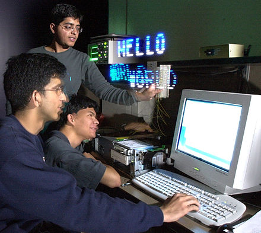

# "Hello, World!" program


$$
\begin{aligned}
\dot{x} & = \sigma(y-x) \\
\dot{y} & = \rho x - y - xz \\
\dot{z} & = -\beta z + xy
\end{aligned}
$$


> from [wikipedia](https://en.wikipedia.org/wiki/%22Hello,_World!%22_program)

"Hello World" redirects here. For other uses, see Hello World (disambiguation).



A "Hello, World!" message being displayed through long-exposure light painting with a moving strip of LEDs
A "Hello, World!" program generally is a computer program that outputs or displays the message "Hello, World!". Such a program is very simple in most programming languages, and is often used to illustrate the basic syntax of a programming language. It is often the first program written by people learning to code.[1][2] It can also be used as a sanity test to make sure that a computer language is correctly installed, and that the operator understands how to use it.

## History

While small test programs have existed since the development of programmable computers, the tradition of using the phrase "Hello, World!" as a test message was influenced by an example program in the seminal 1978 book The C Programming Language.[3] The example program in that book prints "hello, world", and was inherited from a 1974 Bell Laboratories internal memorandum by Brian Kernighan, Programming in C: A Tutorial:[4]

```c
main( ) {
    printf("hello, world\n");
}
```

In the above example, the main( ) function defines where the program should start executing. The function body consists of a single statement, a call to the printf function, which stands for "print formatted". This function will cause the program to output whatever is passed to it as the parameter, in this case the string hello, world, followed by a newline character.

The C language version was preceded by Kernighan's own 1972 A Tutorial Introduction to the Language B,[5] where the first known version of the program is found in an example used to illustrate external variables:

```c
ain( ) {
    extern a, b, c;
    putchar(a); putchar(b); putchar(c); putchar('!*n');
}

a 'hell';
b 'o, w';
c 'orld';
```

The program also prints hello, world! on the terminal, including a newline character. The phrase is divided into multiple variables because in B, a character constant is limited to four ASCII characters. The previous example in the tutorial printed hi! on the terminal, and the phrase hello, world! was introduced as a slightly longer greeting that required several character constants for its expression.

The Jargon File claims that "Hello, World!" originated instead with BCPL (1967).[6] This claim is supposedly supported by the archived notes of the inventors of BCPL, Brian Kernighan at Princeton and Martin Richards at Cambridge. The phrase predated by over a decade its usage in computing; as early as the 1950s, it was the catchphrase of radio disc jockey William B. Williams.[7]

## Variations

"Hello, World!" programs vary in complexity between different languages. In some languages, particularly scripting languages, the "Hello, World!" program can be written as a single statement, while in others (particularly many low-level languages) there can be many more statements required. For example, in Python, to print the string Hello, World! followed by a newline, one need only write `print("Hello, World!")`. In contrast, the equivalent code in C++ [1] requires the import of the input/output software library, the manual declaration of an entry point, and the explicit instruction that the output string should be sent to the standard output stream. Generally, programming languages that give the programmer more control over the machine will result in more complex "Hello, World" programs.[8]

The phrase "Hello World!" has seen various deviations in punctuation and casing, such as the presence of the comma and exclamation mark, and the capitalization of the leading H and W. Some devices limit the format to specific variations, such as all-capitalized versions on systems that support only capital letters, while some esoteric programming languages may have to print a slightly modified string. For example, the first non-trivial Malbolge program printed "HEllO WORld", this having been determined to be good enough.[9] Other human languages have been used as the output; for example, a tutorial for the Go programming language outputted both English and Chinese characters, demonstrating the programming language's built-in Unicode support.[10]

Some languages change the functionality of the "Hello, World!" program while maintaining the spirit of demonstrating a simple example. Functional programming languages, such as Lisp, ML and Haskell, tend to substitute a factorial program for "Hello, World!", as functional programming emphasizes recursive techniques, whereas the original examples emphasize I/O, which violates the spirit of pure functional programming by producing side effects. Languages otherwise capable of printing "Hello, World!" (Assembly, C, VHDL) may also be used in embedded systems, where text output is either difficult (requiring additional components or communication with another computer) or nonexistent. For devices such as microcontrollers, field-programmable gate arrays, and CPLDs, "Hello, World!" may thus be substituted with a blinking LED, which demonstrates timing and interaction between components.[11][12][13][14][15]

The Debian and Ubuntu Linux distributions provide the "Hello, World!" program through their software package manager systems, which can be invoked with the command hello. It serves as a sanity check and a simple example of installing a software package. For developers, it provides an example of creating a .deb package, either traditionally or using debhelper, and the version of hello used, GNU Hello, serves as an example of writing a GNU program.[16]

Variations of the "Hello, World!" program that produce a graphical output (as opposed to text output) have also been shown. Sun demonstrated a "Hello, World!" program in Java based on scalable vector graphics,[17] and the XL programming language features a spinning Earth "Hello, World!" using 3D computer graphics.[18] Mark Guzdial and Elliot Soloway have suggested that the "hello, world" test message may be outdated now that graphics and sound can be manipulated as easily as text.[19]

## Time to Hello World

"Time to hello world" (TTHW) is the time it takes to author a "Hello, World!" program in a given programming language. This is one measure of a programming language's ease-of-use; since the program is meant as an introduction for people unfamiliar with the language, a more complex "Hello, World!" program may indicate that the programming language is less approachable.[8] The concept has been extended beyond programming languages to APIs, as a measure of how simple it is for a new developer to get a basic example working; a faster time indicates an easier API for developers to adopt.[20][21]
